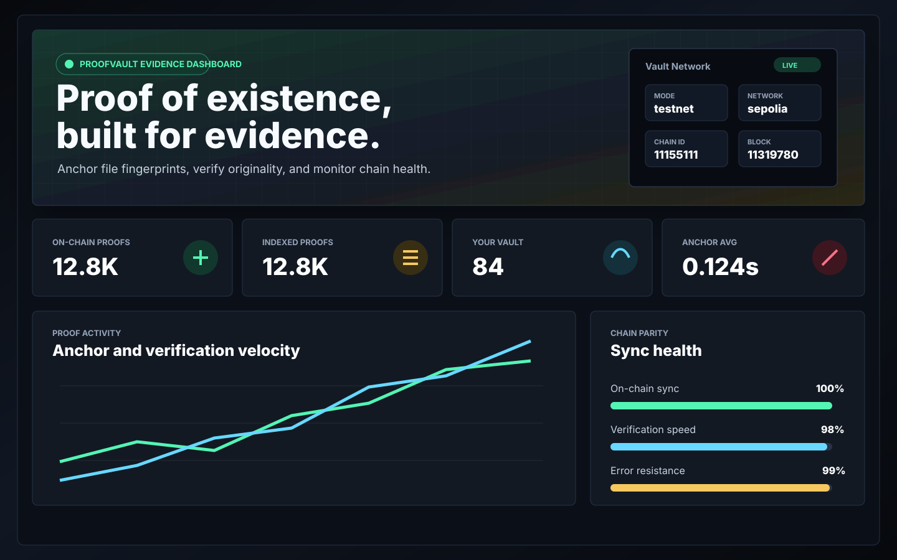
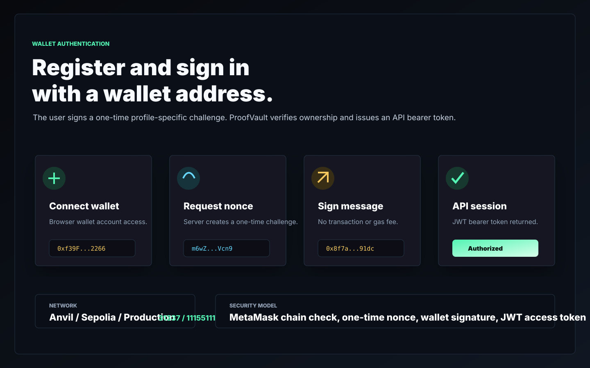
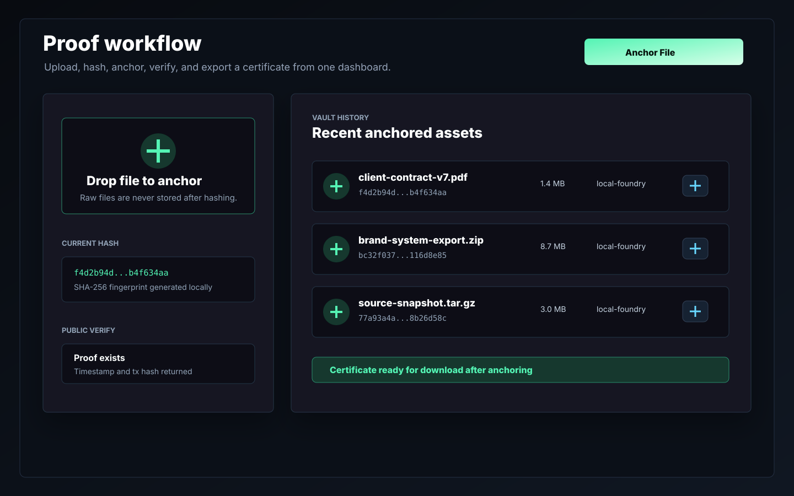
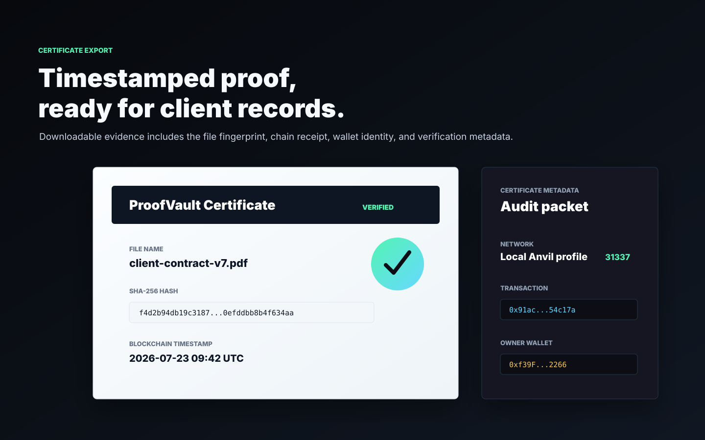
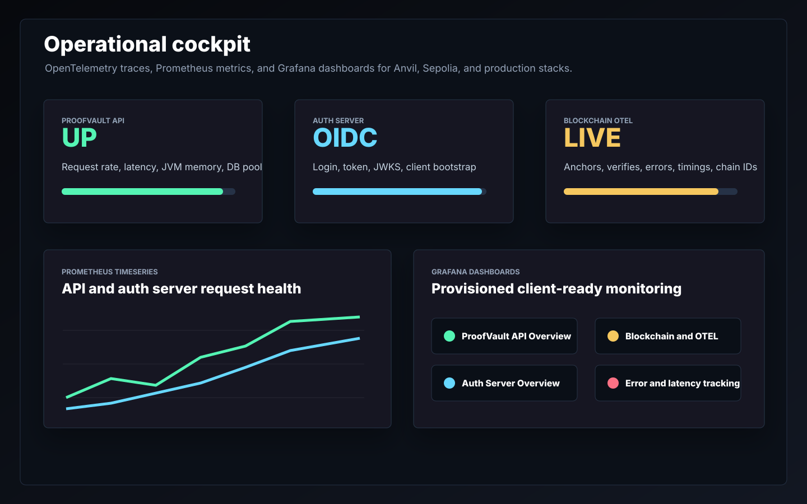
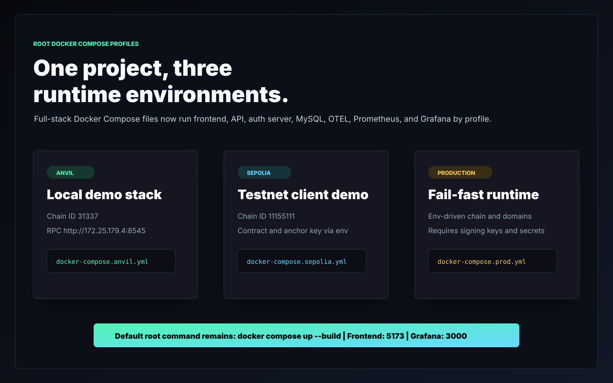

# ProofVault

ProofVault is a blockchain proof-of-existence SaaS platform for proving that a digital file existed at a specific point in time. The application hashes uploaded files, anchors the hash on a blockchain, stores only proof metadata, and lets users verify authenticity later without exposing or storing the original file.

This repository is structured as a production-oriented MVP that can be shown to clients as a complete full-stack proof-of-concept: Next.js frontend, Spring Boot API, Spring Authorization Server, MySQL, Foundry smart contracts, Docker Compose, OpenTelemetry, Prometheus, and Grafana dashboards.

## Product Overview

ProofVault helps creators, freelancers, legal professionals, designers, developers, and businesses establish evidence of originality or authorship for digital work.

Core user flow:

1. User connects a browser wallet and signs a no-gas authentication challenge.
2. User uploads a file through the web app.
3. The API generates a SHA-256 hash.
4. Only the hash and metadata are stored; the raw file is not stored.
5. The offchain API anchors the proof on-chain through the relayer wallet.
6. User receives a timestamped proof record and downloadable certificate.
7. Anyone can later verify the file hash.

## Key Features

- File proof creation with SHA-256 hashing
- Hash-only blockchain anchoring
- Public hash verification
- User-scoped proof history
- Certificate download
- Wallet-first registration and authentication through signed wallet messages
- JWT-secured offchain APIs
- Professional blockchain insights dashboard
- Blockchain health and proof analytics
- OpenTelemetry tracing
- Prometheus metrics
- Grafana dashboards
- Docker Compose full-stack environment
- Upgradeable Solidity smart contract using OpenZeppelin UUPS

## Project Snaps

| Professional dashboard | Wallet authentication |
| --- | --- |
|  |  |
| Proof workflow | Certificate export |
|  |  |
| Observability | Environment profiles |
|  |  |

## Architecture

```text
frontend/
  Next.js wallet-first dashboard

offchain/
  proofvault-api/
    Spring Boot resource API for proofs, certificates, blockchain, and insights

  authserver/
    Spring Authorization Server for JWT issuance and wallet authentication

  docker/
    MySQL init scripts, OTEL Collector, Prometheus, Grafana dashboards

onchain/
  Foundry smart contract package using Solidity and OpenZeppelin
```

High-level flow:

```text
User -> Next.js Frontend -> Auth Server -> ProofVault API -> MySQL
                                             |
                                             v
                                      Onchain network / Anvil
```

The frontend never writes directly to the blockchain. All onchain operations are handled by the offchain API so hashing, authorization, wallet control, persistence, and observability stay centralized.

## Tech Stack

| Layer | Technology |
| --- | --- |
| Frontend | Next.js, React, Recharts, Lucide icons |
| API | Spring Boot, Spring Security, Spring Data JPA |
| Auth | Spring Authorization Server, OAuth2, OIDC, PKCE |
| Database | MySQL, Flyway migrations |
| Onchain | Solidity, Foundry, OpenZeppelin |
| Observability | OpenTelemetry, Prometheus, Grafana |
| Local chain | Anvil |
| Runtime | Docker Compose |

## Repository Structure

```text
proofvault/
  frontend/
    docker-compose.yml
  offchain/
    proofvault-api/
    authserver/
    docker/
    docker-compose.yml
  onchain/
  docs/
  docker-compose.yml
  docker-compose.anvil.yml
  docker-compose.sepolia.yml
  docker-compose.prod.yml
  docker-compose.*.env.example
```

## Full Stack Local Run

Prerequisites:

- Docker Desktop
- Node.js 20+ for frontend-only development
- Java 21 and Maven for offchain-only development
- Foundry for smart contract development

Run the full stack from the project root:

```bash
docker compose up --build
```

The root `docker-compose.yml` is the default full-stack Anvil profile. Explicit environment files are also available:

```bash
# Anvil local chain
docker compose -f docker-compose.anvil.yml up --build

# Sepolia testnet
docker compose -f docker-compose.sepolia.yml up --build

# Production-style runtime
docker compose -f docker-compose.prod.yml up --build
```

For Sepolia and production, copy the matching root env example first:

```bash
cp docker-compose.sepolia.env.example docker-compose.sepolia.env
docker compose --env-file docker-compose.sepolia.env -f docker-compose.sepolia.yml up --build

cp docker-compose.prod.env.example docker-compose.prod.env
docker compose --env-file docker-compose.prod.env -f docker-compose.prod.yml up --build
```

Available services:

| Service | URL |
| --- | --- |
| Frontend | `http://localhost:5173` |
| ProofVault API | `http://localhost:8080` |
| Auth Server | `http://localhost:9000` |
| MySQL | `localhost:3306` |
| External Anvil RPC | `http://172.25.179.4:8545` |
| Prometheus | `http://localhost:9090` |
| Grafana | `http://localhost:3000` |
| Loki | `http://localhost:3100` |
| Tempo | `http://localhost:3200` |
| Promtail | `http://localhost:9080` |
| OTEL Collector metrics | `http://localhost:8888/metrics` |

Grafana credentials:

```text
username: admin
password: proofvault_admin
```

## Demo Login

The frontend login is wallet-first. Connect MetaMask and sign the challenge; no blockchain transaction or gas fee is required.

The local auth server can still bootstrap credentials for API/Postman review:

```text
Email: admin@proofvault.local
Password: ChangeMeLocal123!
```

OAuth clients:

```text
Browser PKCE client: proofvault-spa
Service/Postman client: proofvault-web
Service client secret: proofvault-local-secret
```

If you previously ran the database before the auth server was added, reset local Docker volumes once so the auth bootstrap records are created:

```bash
docker compose -f offchain/docker-compose.yml down -v
docker compose up --build
```

## Offchain Only

Run only offchain services:

```bash
docker compose -f offchain/docker-compose.yml up --build
```

Or from inside `offchain/`:

```bash
docker compose up --build
```

Offchain services include:

- `proofvault-api`
- `proofvault-authserver`
- MySQL
- OpenTelemetry Collector
- Prometheus
- Grafana

More offchain details are available in [`offchain/README.md`](./offchain/README.md).

## Frontend Only With Docker

Run only the frontend container from inside `frontend/`:

```bash
cd frontend
docker compose up --build
```

This serves the frontend on `http://localhost:5173` and expects the API and auth server to be available on `http://localhost:8080` and `http://localhost:9000`.

## Profiles

| Profile | Chain | Chain ID | Frontend env |
| --- | --- | --- | --- |
| `anvil` | Local Anvil | `31337` | `frontend/.env.anvil.example` |
| `sepolia` | Sepolia testnet | `11155111` | `frontend/.env.sepolia.example` |
| `prod` | Production network | env driven | `frontend/.env.production.example` |

For Anvil, copy the Anvil env examples to your real env files and run the offchain services with `SPRING_PROFILES_ACTIVE=anvil`.

For Sepolia, copy the Sepolia env examples and run the offchain services with `SPRING_PROFILES_ACTIVE=sepolia`.

For Docker-based full-stack runs, use the matching root Compose file:

```bash
docker compose -f docker-compose.anvil.yml up --build
docker compose --env-file docker-compose.sepolia.env -f docker-compose.sepolia.yml up --build
docker compose --env-file docker-compose.prod.env -f docker-compose.prod.yml up --build
```

## Frontend Development

```bash
cd frontend
npm install
npm run dev
```

Frontend environment variables:

```text
NEXT_PUBLIC_API_BASE_URL=http://localhost:8080
NEXT_PUBLIC_AUTH_BASE_URL=http://localhost:9000
NEXT_PUBLIC_AUTH_CLIENT_ID=proofvault-spa
NEXT_PUBLIC_AUTH_REDIRECT_URI=http://localhost:5173/oauth2/callback
NEXT_PUBLIC_AUTH_SCOPES=openid profile email proof:read proof:write
NEXT_PUBLIC_WALLET_CHAIN_ID=31337
NEXT_PUBLIC_WALLET_CHAIN_NAME=Local Anvil
NEXT_PUBLIC_WALLET_RPC_URL=http://172.25.179.4:8545
```

Once the wallet is authenticated, the dashboard loads live proof, blockchain, subscription, and observability data from the API.

## API Overview

Main API endpoints:

| Method | Endpoint | Purpose |
| --- | --- | --- |
| `GET` | `/api/me` | Current authenticated user |
| `GET` | `/api/proofs` | Recent user proofs |
| `POST` | `/api/proofs/upload` | Upload and anchor a file proof |
| `POST` | `/api/proofs/verify` | Public hash verification |
| `GET` | `/api/proofs/{proofId}/certificate` | Download proof certificate |
| `GET` | `/api/blockchain/status` | Blockchain connection status |
| `GET` | `/api/blockchain/insights` | Proof and chain analytics |
| `GET` | `/api/blockchain/proofs/{fileHash}` | On-chain proof lookup |
| `GET` | `/api/observability/blockchain` | Blockchain OTEL metrics |

Postman collections:

- [`offchain/proofvault-api/postman/ProofVault.postman_collection.json`](./offchain/proofvault-api/postman/ProofVault.postman_collection.json)
- [`offchain/authserver/postman/ProofVaultAuthServer.postman_collection.json`](./offchain/authserver/postman/ProofVaultAuthServer.postman_collection.json)

## Authentication

The project includes a dedicated Spring Authorization Server microservice.

Supported auth capabilities:

- Wallet challenge authentication
- OAuth2 authorization code flow with PKCE for internal/future extension
- OpenID Connect discovery
- JWT access tokens
- JWKS endpoint
- JDBC-backed registered clients
- JDBC-backed users
- Wallet-based sign-in using a nonce challenge and browser wallet signature
- Local bootstrap user and clients
- Profile-specific configuration for local, docker, dev, staging, and prod

The frontend uses the public `proofvault-spa` client. The API validates JWTs issued by the auth server and checks the configured audience `proofvault-api`.
For wallet login, the frontend connects to the browser wallet, requests a profile-specific nonce challenge from the auth server, signs it with the wallet, and receives the bearer token used by the API.

## Onchain Layer

The smart contract package is in [`onchain/`](./onchain).

Highlights:

- Solidity smart contract for immutable proof registry
- OpenZeppelin UUPS upgradeability
- OpenZeppelin role-based access control
- Pausable emergency stop
- Append-only proof records
- Batch anchoring support
- No raw files, filenames, or readable file data stored on-chain

Common commands:

```bash
cd onchain
npm install
forge install foundry-rs/forge-std
forge build
forge test
```

More details are available in [`onchain/README.md`](./onchain/README.md) and [`onchain/SECURITY.md`](./onchain/SECURITY.md).

## Observability

The stack includes production-style observability:

- OpenTelemetry tracing from offchain services
- Prometheus metrics scraping
- Loki log storage through Promtail
- Tempo trace storage from the OTEL Collector
- Grafana dashboards for:
  - ProofVault API overview
  - Auth server overview
  - Blockchain and OTEL activity
  - Logs and traces

Grafana dashboards are provisioned from:

```text
offchain/docker/grafana/dashboards/
```

Useful Grafana Explore queries:

```logql
{service="proofvault-api"}
{service="proofvault-authserver"}
```

## Security Notes

- Raw uploaded files are not stored.
- Only SHA-256 hashes and metadata are persisted.
- The frontend uses PKCE instead of storing a client secret.
- The API validates JWT issuer and audience.
- Smart contract upgrades require a privileged role and paused state.
- Production signing keys should be configured explicitly for the auth server.
- Production blockchain roles should use a multisig or controlled relayer.
